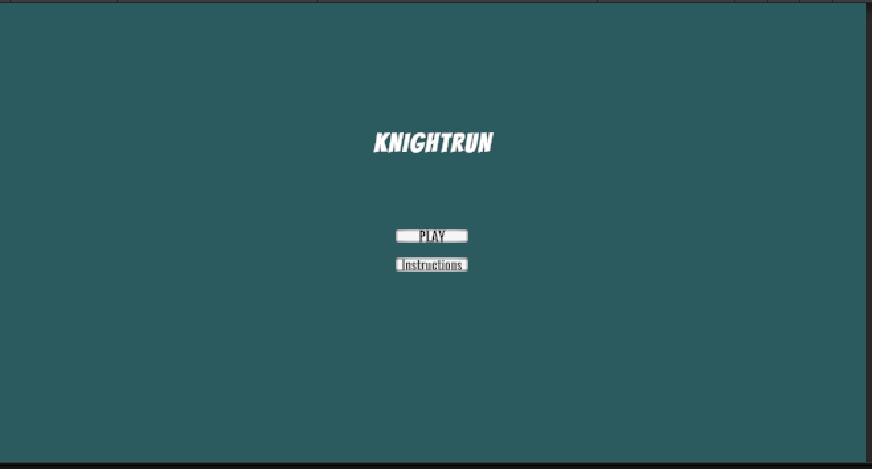
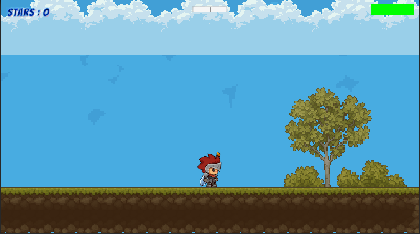
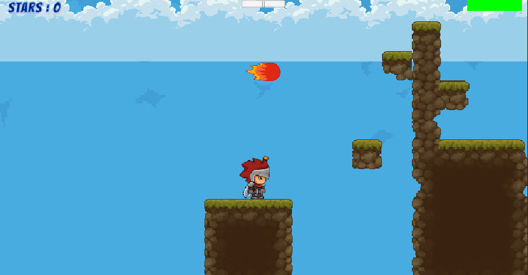

# Unity 2D Platformer Game

A Unity 2D platformer project featuring multi-level gameplay, collectible-based progression, moving hazards, double jump mechanics, and responsive gameplay systems built using Unity and C#.

The game focuses on classic platforming mechanics combined with smooth movement systems, level progression logic, gameplay feedback, and organized scene management.

---

## Features

- 2D platformer movement system
- Jump and double jump mechanics
- Multi-level gameplay progression
- Main menu and scene management system
- Collectible star objectives
- Hazard and collision systems
- Moving hazards and animated collectibles
- Tilemap-based level design
- Gameplay UI systems
- Audio feedback and background music integration
- Organized gameplay architecture

---

## Technologies Used

- Unity 6
- C#
- Unity Tilemap System
- Unity Animator
- Unity UI System
- Rigidbody2D Physics

---

## Gameplay Overview

Players navigate through platforming levels while collecting stars and avoiding hazards.

### Core Gameplay Mechanics
- Collect 3 stars to complete the level
- Avoid spikes and moving hazards
- Use double jump mechanics to traverse difficult platforms
- Progress through multiple levels using scene transitions

---

## Core Systems

### Player Systems
- Player movement controller
- Double jump mechanics
- Animation controller integration
- Rigidbody2D physics interactions

### Gameplay Systems
- Collectible tracking
- Hazard collision handling
- Level progression logic
- Scene transition management

### UI Systems
- Main menu scene
- Gameplay UI
- Pause functionality
- Restart and level progression interactions

### Audio Systems
- Gameplay sound effects
- Background music integration
- UI interaction sounds

---

## Project Structure

```bash
Assets/
│
├── Animations/
├── Audio/
├── Prefabs/
├── Scenes/
├── Scripts/
│   ├── Player/
│   ├── Gameplay/
│   ├── Managers/
│   ├── UI/
│   └── Audio/
│
├── Sprites/
│   ├── Player/
│   ├── Collectibles/
│   ├── Hazards/
│   └── UI/
│
├── Tilemap/
└── Screenshots/
```

---

## Controls

| Action | Input |
|---|---|
| Move | A / D or Arrow Keys |
| Jump | Space |
| Double Jump | Space (mid-air) |

---

## Screenshots

### Main Menu


### Gameplay


### Level Progression



---

## Future Improvements

- Additional platforming levels
- Enemy AI systems
- Mobile control support
- Advanced visual effects
- Checkpoint system
- Save/load progression system

---

## Author

**Abin George**

GitHub: https://github.com/abinshabi-netizen